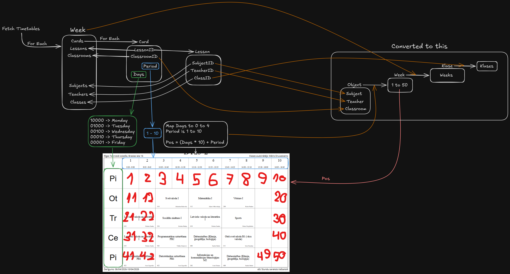

# RTK Stundu Saraksts

Servers ar telegram botu un api, kas noformē un pasniedz informāciju no - [edupage](https://rtk.edupage.org/timetable/view.php).

## Requirements

- Node.js

## Setup

```bash
npm install
```

Create `server/.env`:

```env
API_PORT=10000
BOT_TOKEN=NONE
WEBHOOK_URL=NONE
```
`BOT_TOKEN` - Telegram bot token. Set to `NONE` or omit to disable the bot.

`WEBHOOK_URL` - public URL for webhook mode. Set to `NONE` or omit for long polling.

### Webhook vs Polling

By default the bot uses **long polling** - it repeatedly asks Telegram for new updates. This works locally and on any server that stays running.

Set `WEBHOOK_URL` to your public URL to use **webhooks** instead - Telegram pushes updates to your server. This is better for hosted environments like Render where the app only runs when it receives requests.

On Render, `RENDER_EXTERNAL_URL` is [set automatically](https://render.com/docs/environment-variables). You can use it as your `WEBHOOK_URL` value.

## Run

```bash
npm start
```

## Logic 
How data from edupage looks and connects:


How the data gets transformed on the server:
