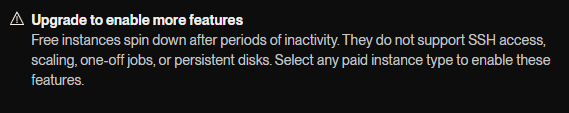

# RTK Stundu Saraksts

Servers ar telegram botu un api, kas noformē un pasniedz informāciju no - [edupage](https://rtk.edupage.org/timetable/view.php).

## Requirements

- Node.js

## Setup

```bash
npm install
```

Create `server/.env`:

```env
API_PORT=10000
BOT_TOKEN=NONE
WEBHOOK_URL=NONE
```
`BOT_TOKEN` - Telegram bot token. Set to `NONE` or omit to disable the bot.

`WEBHOOK_URL` - public URL for webhook mode. Set to `NONE` or omit for long polling.

### Webhook vs Polling

By default the bot uses **long polling** - it repeatedly asks Telegram for new updates. This works locally and on any server that stays running.

Set `WEBHOOK_URL` to your public URL to use **webhooks** instead - Telegram pushes updates to your server. This is better for hosted environments like Render where the app only runs when it receives requests.

On Render, `RENDER_EXTERNAL_URL` is [set automatically](https://render.com/docs/environment-variables). You can use it as your `WEBHOOK_URL` value.

## Important Note

The server was made for hosting on a free instance on [render](https://render.com) so it doesnt support features such as: the bot remembering or allowing the setting of your group, uses a once precomputed list of 54 weeks worth of data saved in a js file for quick loading (reduced loading time from 7sec to 0.5sec) instead of having a database or a dumb onto the disk that gets refreshed every 6 or 12 hours, has to re fetch the data every time it starts.
 

## Run

```bash
npm start
```

## Logic 

### Data

On startup, `data.js` fetches timetable data from [edupage](https://rtk.edupage.org/timetable/view.php). Edupage stores timetables as numbered weeks, each containing cards, lessons, classes, subjects, teachers, and classrooms as separate linked tables.


The fetch process pulls each week's raw tables and transforms them into a flat structure grouped by class name, where each group contains its weeks and each week contains slot entries keyed by position (day × 10 + period).


Previously fetched weeks are stored in `precomputed.js` to avoid re-fetching on every startup. Only new weeks not in the precomputed cache are fetched.

### API

A simple Express server exposing two endpoints:

`GET /api/groups` - returns all group names with pagination metadata.

`GET /api/group/:name?page=1` - returns a paginated list of weeks and their slots for a given group.

### Bot

A Telegram bot built with grammY. Users select a group through a two-step inline keyboard (prefix -> group) and receive formatted timetable data.

Commands: `/today`, `/tmrw`, `/week`, `/nweek`.

The bot supports both long polling (local development) and webhooks (hosted environments) based on the `WEBHOOK_URL` configuration.